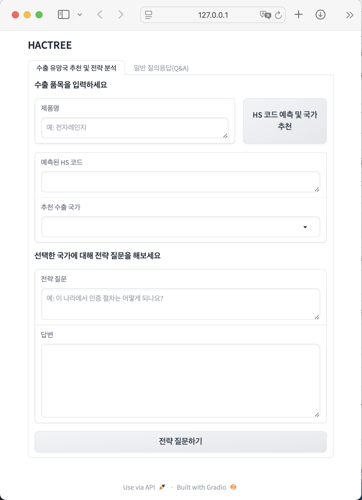
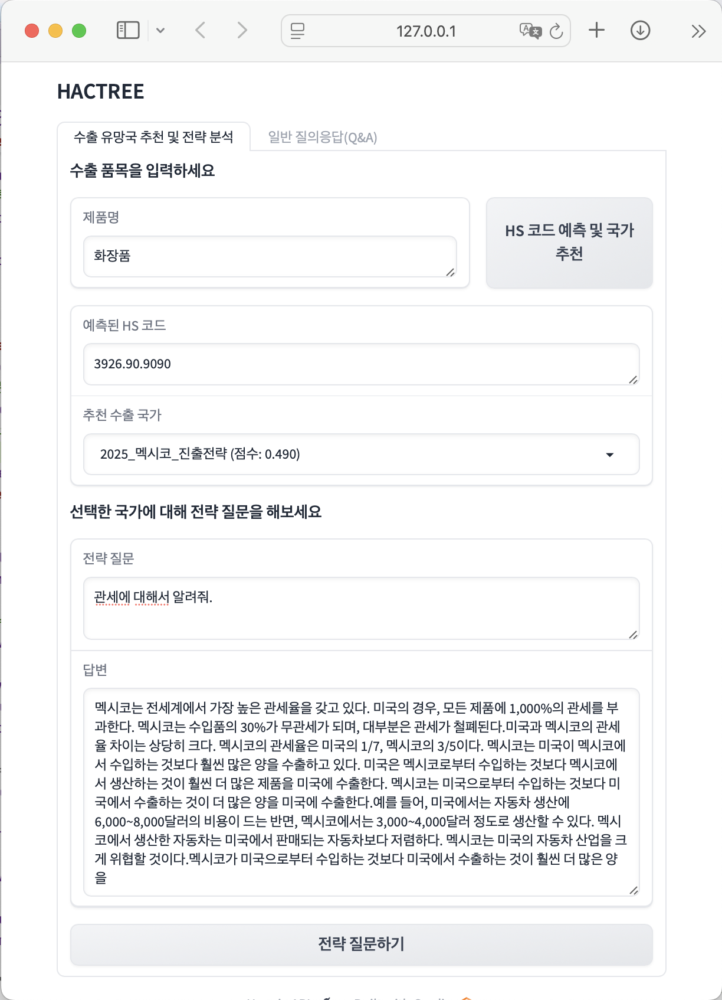
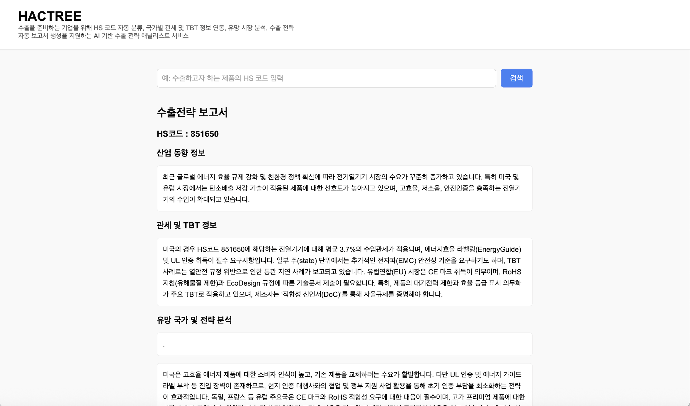
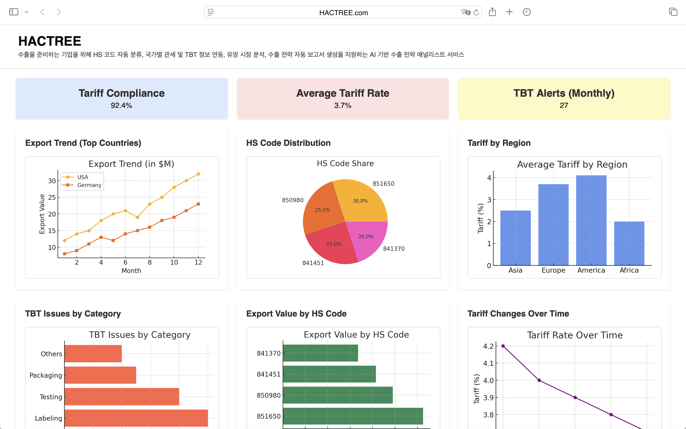

## HACTREE: HS Code Auto Classification and Trade Report for Export Enterprises

### 1. Project Topic

HACTREE is a trade strategy platform that helps enterprises prepare for international markets. It offers automated HS code classification, integrated access to country-specific tariff and TBT (Technical Barriers to Trade) data, and promising market ranking　and analysis.

  
  

##### *[Picture 1] resent UI with GRADIO*

##### *[Picture 2] Future UI with HTML*

---

### 2. Description

#### Objective

The goal of this project is to build an AI solution that simplifies export strategy development.

#### Background and Motivation

* Global trade risks such as Trump's tariff war can lead higher tariffs, lost FTA benefits, and weakened export strategies for enterprises.
* The Export enterprises (**SMEs located outside major cities**) often lack the resources and expertise required for strategy development.
* The burden of interpretation and strategy development remains on exporters.
* There is a growing demand for AI services that interprete and consolidate complex regulatory and tariff data that requires expert knowlegdes for trade.
* This project further develops the award-winning idea "TREE" in the 2023 competition into a practical and scalable solution.

#### Main Tasks

* **Development Environment**: Python 3.10, Visual Studio Code

| **Main Function**                                     | **Description**                                                                                                                                                            | **Tool**                                                                 |
| ----------------------------------------------------- | -------------------------------------------------------------------------------------------------------------------------------------------------------------------------- | ------------------------------------------------------------------------------------- |
| **Local Database**                           | Store trade-related datas (raw and structured form) such as country reports, market news, and industry | File system |
| **Automated Text Extraction & Vectorization**         | Detect file type (text or image), extracts text, splits into semantic chunks, and converts into embeddings stored in FAISS                                              | LangChain, sentence-transformers     |
| **HS Code Prediction & Export Market Recommendation** | Predict top HS codes from product descriptions and recommend promising export destinations based on tariffs, import volume, and TBT barriers                            | BiLSTM (PyTorch)           |
| **Vector Search Engine (RAG)**          | Match natural language queries with document chunks, integrating predicted HS codes and country info for accurate retrieval                                             | FAISS                                 |
| **LLM-Based Report**                       | Generate natural language responses and export strategy reports tailored to user input.                                                                        | Polyglot-ko                              |

#### Datasets
* Public trade reports from KOTRA
  * Country information
  * Import/export trade status by country
  * Overseas market news
  * Market entry strategies
  * Industry trends by market
  * Import regulation status by country

* Training Data for HS code classification models from Korea Customs Service (UNIPASS)
  * Basic tariffs, FTA tariffs, import requirements, and TBT cases by HS code and country
  * Product names and HS codes designated by Korea Customs Service

#### Expected Contribution

* **Decreasing the Digital Gap for SMEs**
  * Automate export strategy formulation, enabling SMEs under shortage of experts and resources to make strategic decisions
  * Reduce digital disparities in the export ecosystem and make more enterprises participate in export market

* **Improving Risk Management for Regulations and Tariffs**
  * Detect and warn against HS code misclassification, tariff misjudgments, and technical barriers (TBT)
  * Support early mitigation of trade risks and reduce the likelihood of export failures
